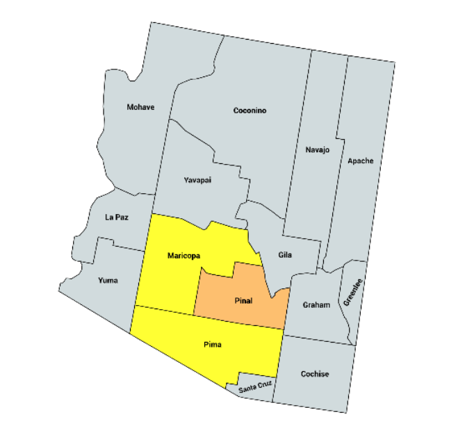

<link rel="icon" type="image/x-icon" href="https://mapper.auditengine.org/assets/images/A.png">

# Audit Projects -- Arizona 2020

- **Top Counties --** Arizona's 15 counties is extremely concentrated in just a few. The largest county, Maricopa County, 60% of the electorate, and the top three counties comprise more than 80% of the electorate.

- **Ballot Images --** Ballot images are considered public records but are not available to the public. However, we have requested the ballot images from the 2020 Election due to the audit conducted there, they may be available in private mode.

- **Voting System --** Arizona uses ES&S, Dominion, and Clear Ballot (one county) voting systems.

- **Official Audits --** Signed into law 2006, Arizona's audit law calls for one federal, one statewide, and one legislative contest to be audited, in addition to one ballot measure and the presidential contest. 
  
  - http://law.justia.com/codes/arizona/2016/title-16/section-16-602/ -- Audit laws
  
    The selection of the precincts shall not begin until all ballots voted in the precinct polling places have been delivered to the central counting center. The unofficial vote totals from all precincts shall be made public before selecting the precincts to be hand counted.
  
    Arizona considers early-arriving VBM ballots in the set of "early ballots," and they sample "one percent of the total number of early ballots cast or five thousand early ballots, whichever is less", and the manual tally will escalate if the hand count shows that the contest outcome is different from the computer outcome, in terms of the winning contest option.
  
- **2020 Senate Audit --** In 2020, the AZ state senate conducted an audit of Maricopa County. We have requested the ballot images but they have not been provided.

  (Note: The Number of voters shown below is not absolutely current, but still provides valid relative ranking.)

| State | Jurisdiction    | Main City        | Voters  | Natl Rank | Cum Voters | Rank | % Total | Vendor |
| ----- | --------------- | ---------------- | ------- | --------- | ---------- | ---- | ------- | ------ |
| AZ    | MARICOPA COUNTY | Phoenix          | 2264677 | 2         | 2264677    | 1    | 59.55%  | Dom.   |
| AZ    | PIMA COUNTY     | Tucson           | 585691  | 50        | 2850368    | 2    | 74.95%  | ES&S   |
| AZ    | PINAL COUNTY    | Near Phoenix     | 195332  | 207       | 3045700    | 3    | 80.09%  | ES&S   |
| AZ    | YAVAPAI COUNTY  | Prescott         | 149304  | 262       | 3195004    | 4    | 84.02%  | Unisyn |
| AZ    | MOHAVE COUNTY   | Lake Havasu City | 136847  | 285       | 3331851    | 5    | 87.62%  | ES&S   |
| AZ    | YUMA COUNTY     | Yuma             | 92798   | 407       | 3424649    | 6    | 90.06%  | ES&S   |
| AZ    | COCONINO COUNTY | Flagstaff        | 85513   | 435       | 3510162    | 7    | 92.31%  | ES&S   |
| AZ    | COCHISE COUNTY  | Bisbee           | 79011   | 467       | 3589173    | 8    | 94.38%  | ES&S   |

