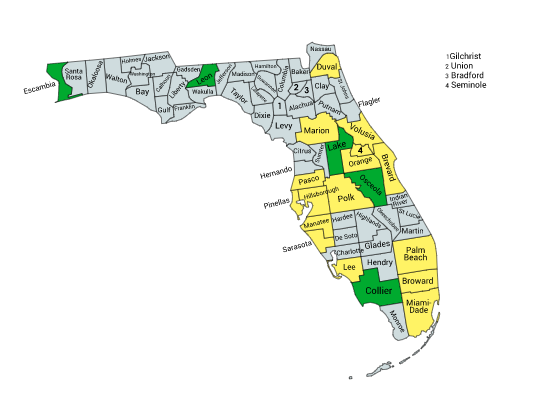

<link rel="icon" type="image/x-icon" href="https://mapper.auditengine.org/assets/images/A.png">

# Audit Projects -- Florida (FL_2020)

- **Top Counties --** In Georgia, the top 20 counties out of 67 (29%) includes 80% of the electorate
- **Ballot Images --** Ballot images are generally available by Public Records Request and AuditEngine has been tested on many of them. Florida officially allows counties to utilize 3rd-party independent automated audits. Many counties systematically delete their ballot images, and this is current being reviewed in court cases.

- **Voting System --** Florida uses both ES&S and Dominion voting systems.

- **Official Audits --** Signed into law in 2007, [Florida's audit law](http://www.leg.state.fl.us/statutes/index.cfm?mode=ViewStatutes&SubMenu=1&App_mode=Display_Statute&Search_String=101.591&URL=0100-0199/0101/Sections/0101.591.html) is not binding on official results, does not lead to a full recount, and audits only one randomly-selected election contest, selected separately in each county. No contest with boundaries greater than a county-wide contest can be effectively audited. In 2013 the audit law was amended to provide, in addition to a manual audit, the option of an "automated independent audit".

  The manual audit "shall consist of a public manual tally of the votes cast in one randomly selected race that appears on the ballot." See[Fla. Stat. Ann. §101.591(2)(a)](http://law.justia.com/codes/florida/2016/title-ix/chapter-101/section-101.591/).The automated audit "shall consist of a public automated tally of the votes cast across every race that appears on the ballot." See[Fla. Stat. Ann. §101.591(2)(b)](http://law.justia.com/codes/florida/2016/title-ix/chapter-101/section-101.591/).

- **Poll Tapes --** We have also been able to access "digital poll tapes" which we can use in a "Poll Tapes Audit" and it has been helpful in tracking down issues there.

  (Note: The Number of voters shown below is not absolutely current, but still provides valid relative ranking.)

| State | Jurisdiction        | Main City       | Voters  | Natl Rank | Cum Voters | Rank | % Total | Ballot Imaging        | Status |
| ----- | ------------------- | --------------- | ------- | --------- | ---------- | ---- | ------- | --------------------- | ------ |
| FL    | MIAMI-DADE COUNTY   | Miami           | 1367165 | 9         | 1367165    | 1    | 10.77%  | Y-ES&S Not saved      |        |
| FL    | BROWARD COUNTY      | Fort Lauderdale | 1198616 | 12        | 2565781    | 2    | 20.22%  | Y-ES&S Not saved      |        |
| FL    | PALM BEACH COUNTY   | West Palm Beach | 912705  | 23        | 3478486    | 3    | 27.41%  | Y-ES&S                |        |
| FL    | HILLSBOROUGH COUNTY | Tampa           | 801880  | 32        | 4280366    | 4    | 33.73%  | Y-ES&S (Clear Ballot) |        |
| FL    | ORANGE COUNTY       | Orlando         | 758134  | 33        | 5038500    | 5    | 39.71%  | Y-ES&S                |        |
| FL    | PINELLAS COUNTY     | St. Petersburg  | 659344  | 40        | 5697844    | 6    | 44.90%  | Y-ES&S                |        |
| FL    | DUVAL COUNTY        | Jacksonville    | 587025  | 49        | 6284869    | 7    | 49.53%  | Y-ES&S                |        |
| FL    | LEE COUNTY          | Fort Myers      | 426342  | 80        | 6711211    | 8    | 52.89%  | Y-ES&S                |        |
| FL    | BREVARD COUNTY      | Palm Bay        | 407910  | 87        | 7119121    | 9    | 56.10%  | Y-ES&S                |        |
| FL    | POLK COUNTY         | Lakeland        | 374122  | 99        | 7493243    | 10   | 59.05%  | Y-ES&S                |        |
| FL    | VOLUSIA COUNTY      | Deltona         | 359774  | 105       | 7853017    | 11   | 61.89%  | Y-ES&S                |        |
| FL    | PASCO COUNTY        | New Port Richey | 323416  | 116       | 8176433    | 12   | 64.44%  | Y-ES&S                |        |
| FL    | SARASOTA COUNTY     | Sarasota        | 290553  | 130       | 8466986    | 13   | 66.73%  | Y-ES&S                |        |
| FL    | SEMINOLE COUNTY     | Sanford         | 280750  | 138       | 8747736    | 14   | 68.94%  | Y-ES&S                |        |
| FL    | MARION COUNTY       | Ocala           | 233168  | 169       | 8980904    | 15   | 70.78%  | Y-ES&S                |        |
| FL    | MANATEE COUNTY      | Bradenton       | 224862  | 176       | 9205766    | 16   | 72.55%  | Y-ES&S                |        |
| FL    | LAKE COUNTY         | Clermont        | 216545  | 182       | 9422311    | 17   | 74.26%  | Y-ES&S                |        |
| FL    | ESCAMBIA COUNTY     | Pensacola       | 208823  | 189       | 9631134    | 18   | 75.90%  | Y-ES&S                |        |
| FL    | COLLIER COUNTY      | Naples          | 201705  | 195       | 9832839    | 19   | 77.49%  | Y-ES&S                |        |
| FL    | LEON COUNTY         | Tallahassee     | 201183  | 196       | 10034022   | 20   | 79.08%  | Y-Dom                 |        |
| FL    | OSCEOLA COUNTY      | Kissimmee       | 193140  | 208       | 10227162   | 21   | 80.60%  | Y-ES&S                |        |
| FL    | ST. LUCIE COUNTY    | Port St. Lucie  | 189249  | 215       | 10416411   | 22   | 82.09%  | Y-Dom                 |        |
| FL    | ALACHUA COUNTY      | Alachua         | 172137  | 228       | 10588548   | 23   | 83.45%  |                       |        |

