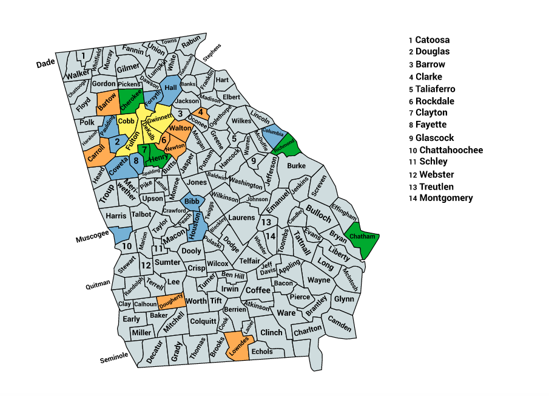

<link rel="icon" type="image/x-icon" href="https://mapper.auditengine.org/assets/images/A.png">

# Audit Projects -- Georgia 2020 (GA_2020)

- **Top Counties --** In Georgia, the top 27 counties out of 159 (17%) includes 70% of the electorate

- **Ballot Images --** Recent changes in state law provides that all ballot images are available, and we have obtained more than half of them as of this writing.

- **Voting System --** Georgia uses the same Dominion voting system in all counties, which does make the auditing process a little easier because the images and cast vote records are all the same format, but each county has different sets of styles and naming conventions.

- **Official Audits --** Georgia does not require post-election audits. However, a RLA pilot program exists and in 2020, a full handcount was implemented for the presidential contest.

- **Funding Target** -- Our general cost guidelines suggest a <u>funding target of $210,000 for the top 27 counties</u>, barring exceptional issues, and with limited styles.  **[Donate for GA audits now!](https://engine.auditengine.org/projects/GA_20201103)**

  - **Top 4 Counties: 34% of the state, 2.05M voters -- $60K**
    - Fulton, Dekalb, Gwinnett, Cobb

  - **Next 7 Counties: 50% (cum) of the state, add'l 980K voters -- $55K**
    - Chatham, Clayton, Cherokee, Henry, Richmond, Forsyth, Muscogee

  - **Next 8 Counties: 60% (cum) of the state, add'l 626K voters -- $40K**
    - Hall, Bibb, Columbia, Houston, Paulding, Coweta, Douglas, Fayette

  - **Next 8 Counties: 70% (cum) of the state, add'l 570K voters -- $55K** 
    - Fayette, Clarke, Carroll, Newton, Lowndes, Bartow, Dougherty, Rockdale, Walton

- **Status --** Bartow County, the first to provide ballot images is nearly complete, but we discovered an unusual manner in which they are indicating adjudicated overvotes, as they are changing these to undervotes and blank contests. Indeed, the net result is the same, and there is a sufficient audit trail to understand what they are doing, but it will be an issue we will broach in our audit

  (Note: The Number of voters shown below is not absolutely current, but still provides valid relative ranking.)

| State |   Jurisdiction   |     Main City     | Voters | Natl Rank | Cum Voters | Rank | % State | Status |
| :---: | :--------------: | :---------------: | :----: | :-------: | :--------: | :--: | :-----: | :----: |
|  GA   |  FULTON COUNTY   |      Atlanta      | 656869 |    42     |   656869   |  1   | 10.89%  |        |
|  GA   |  DEKALB COUNTY   |    Brookhaven     | 468492 |    67     |  1125361   |  2   | 18.66%  |        |
|  GA   | GWINNETT COUNTY  | Peachtree Corners | 463681 |    69     |  1589042   |  3   | 26.35%  |        |
|  GA   |   COBB COUNTY    |     Marietta      | 460075 |    70     |  2049117   |  4   | 33.98%  |        |
|  GA   |  CHATHAM COUNTY  |     Savannah      | 173365 |    227    |  2222482   |  5   | 36.86%  |        |
|  GA   |  CLAYTON COUNTY  |    Forest Park    | 154445 |    249    |  2376927   |  6   | 39.42%  |        |
|  GA   | CHEROKEE COUNTY  |     Woodstock     | 145689 |    268    |  2522616   |  7   | 41.84%  |        |
|  GA   |   HENRY COUNTY   |    Stockbridge    | 137332 |    284    |  2659948   |  8   | 44.11%  |        |
|  GA   | RICHMOND COUNTY  |      Augusta      | 126024 |    301    |  2785972   |  9   | 46.20%  |        |
|  GA   |  FORSYTH COUNTY  |      Cumming      | 120980 |    314    |  2906952   |  10  | 48.21%  |        |
|  GA   | MUSCOGEE COUNTY  |     Columbus      | 120024 |    316    |  3026976   |  11  | 50.20%  |        |
|  GA   |   HALL COUNTY    |    Gainesville    | 96672  |    392    |  3123648   |  12  | 51.80%  |        |
|  GA   |   BIBB COUNTY    |       Macon       | 93856  |    402    |  3217504   |  13  | 53.36%  |        |
|  GA   | COLUMBIA COUNTY  |       Evans       | 90764  |    412    |  3308268   |  14  | 54.87%  |        |
|  GA   |  HOUSTON COUNTY  |   Warner Robins   | 89928  |    416    |  3398196   |  15  | 56.36%  |        |
|  GA   | PAULDING COUNTY  |      Dallas       | 86790  |    429    |  3484986   |  16  | 57.80%  |        |
|  GA   |  COWETA COUNTY   |      Newnan       | 84822  |    437    |  3569808   |  17  | 59.20%  |        |
|  GA   |  DOUGLAS COUNTY  |   Douglasville    | 82786  |    443    |  3652594   |  18  | 60.58%  |        |
|  GA   |  FAYETTE COUNTY  |  Peachtree City   | 80863  |    454    |  3733457   |  19  | 61.92%  |        |
|  GA   |  CLARKE COUNTY   |      Athens       | 67125  |    531    |  3800582   |  20  | 63.03%  |        |
|  GA   |  CARROLL COUNTY  |    Carrollton     | 64925  |    544    |  3865507   |  21  | 64.11%  |        |
|  GA   |  NEWTON COUNTY   |     Covington     | 64894  |    545    |  3930401   |  22  | 65.18%  |        |
|  GA   |  LOWNDES COUNTY  |     Valdosta      | 61726  |    578    |  3992127   |  23  | 66.21%  |        |
|  GA   |  BARTOW COUNTY   |   Cartersville    | 58994  |    595    |  4051121   |  24  | 67.19%  |        |
|  GA   | DOUGHERTY COUNTY |      Albany       | 58498  |    601    |  4109619   |  25  | 68.16%  |        |
|  GA   | ROCKDALE COUNTY  |      Conyers      | 56751  |    614    |  4166370   |  26  | 69.10%  |        |
|  GA   |  WALTON COUNTY   |      Monroe       | 55719  |    621    |  4222089   |  27  | 70.02%  |        |

