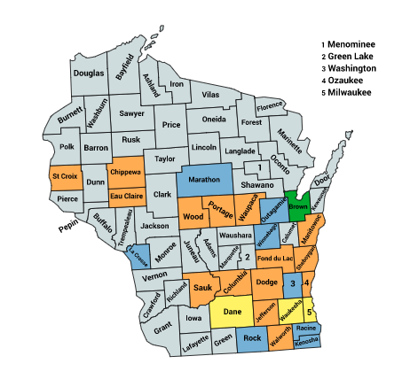

<link rel="icon" type="image/x-icon" href="https://mapper.auditengine.org/assets/images/A.png">

# Wisconsin 2020 (WI_2020)

- **Top Counties --** In Wisconsin, top 18 counties out of 72 (25%) includes 70% of the electorate.
- **Ballot Images --** Ballot images are generally available by Public Records Request and AuditEngine has been tested on several counties, including Dane County, one of the earliest to support the release of ballot images. 

- **Voting System --** Wisconsin uses ES&S, Dominion, and Clear Ballot (one county) voting systems.

- **Official Audits --** Passed in 2006, Wisconsin's audit legislation is not binding upon election results and cannot be expanded to a full recount. Audit law: http://law.justia.com/codes/wisconsin/2016/chapter-7/section-7.08/ 
  No mention is made of early, absentee, or provisional ballots in the statute governing audits or in the audit procedures outlined by the Election Commission. Wis. Stat. Ann. §7.08(6) requires only that electronic voting systems in each reporting unit be audited.
  Only general elections are audited. See Wis. Stat. Ann. §7.08(6). "Four (4) contests shall be audited, including the top contest on the ballot (either gubernatorial or presidential). The other audited contests shall be selected randomly by the Election Commission staff from the other state contests that appear on the ballot." 

  Wisconsin audits reporting units, which can be a ward, a combination of wards or other districts by which votes are tallied. See VSAR, page 1, Definitions". "The Election Commission staff will randomly select one hundred (100) reporting units across Wisconsin which will be subject to municipal audit, including a minimum of five (5) reporting units for each voting system used in Wisconsin."

  (Note: The Number of voters shown below is not absolutely current, but still provides valid relative ranking.)

| State | Jurisdiction       | Main City        | Voters | Natl Rank | Cum Voters | Rank | % Total | Vendor        |
| ----- | ------------------ | ---------------- | ------ | --------: | ---------: | ---- | ------- | ------------- |
| WI    | MILWAUKEE COUNTY   | Milwaukee        | 566816 |        52 |     566816 | 1    | 15.66%  | ES&S          |
| WI    | DANE COUNTY        | Madison          | 385063 |        95 |     951879 | 2    | 26.30%  | ES&S          |
| WI    | WAUKESHA COUNTY    | Waukesha         | 278896 |       141 |    1230775 | 3    | 34.00%  | ES&S          |
| WI    | BROWN COUNTY       | Green Bay        | 152605 |       255 |    1383380 | 4    | 38.21%  | ES&S          |
| WI    | RACINE COUNTY      | Racine           | 116894 |       323 |    1500274 | 5    | 41.44%  | Dom           |
| WI    | OUTAGAMIE COUNTY   | Appleton         | 111477 |       342 |    1611751 | 6    | 44.52%  | ES&S          |
| WI    | WINNEBAGO COUNTY   | Oshkosh          | 104771 |       363 |    1716522 | 7    | 47.42%  | Dom           |
| WI    | KENOSHA COUNTY     | Kenosha          | 95559  |       395 |    1812081 | 8    | 50.06%  | ES&S          |
| WI    | ROCK COUNTY        | Janesville       | 93821  |       403 |    1905902 | 9    | 52.65%  | ES&S          |
| WI    | WASHINGTON COUNTY  | West Bend        | 89277  |       418 |    1995179 | 10   | 55.12%  | Dom           |
| WI    | MARATHON COUNTY    | Wausau           | 82281  |       447 |    2077460 | 11   | 57.39%  | ES&S          |
| WI    | LA CROSSE COUNTY   | La Crosse        | 79500  |       461 |    2156960 | 12   | 59.58%  | ES&S          |
| WI    | SHEBOYGAN COUNTY   | Sheboygan Falls  | 71453  |       505 |    2228413 | 13   | 61.56%  | Clear         |
| WI    | EAU CLAIRE COUNTY  | Eau Claire       | 66509  |       536 |    2294922 | 14   | 63.40%  | ES&S          |
| WI    | OZAUKEE COUNTY     | Mequon           | 64602  |       547 |    2359524 | 15   | 65.18%  | Dom           |
| WI    | WALWORTH COUNTY    | Whitewater       | 62241  |       568 |    2421765 | 16   | 66.90%  | Dom           |
| WI    | FOND DU LAC COUNTY | Fond du Lac      | 60664  |       583 |    2482429 | 17   | 68.58%  | Dom           |
| WI    | ST. CROIX COUNTY   | Hudson           | 56905  |       613 |    2539334 | 18   | 70.15%  | ES&S          |
| WI    | JEFFERSON COUNTY   | Watertown        | 52083  |       659 |    2591417 | 19   | 71.59%  | ES&S          |
| WI    | DODGE COUNTY       | Beaver Dam       | 51594  |       668 |    2643011 | 20   | 73.01%  | ES&S          |
| WI    | MANITOWOC COUNTY   | Manitowoc        | 48721  |       703 |    2691732 | 21   | 74.36%  | ES&S          |
| WI    | PORTAGE COUNTY     | Stevens Point    | 47530  |       712 |    2739262 | 22   | 75.67%  | ES&S          |
| WI    | WOOD COUNTY        | Wisconsin Rapids | 44072  |       742 |    2783334 | 23   | 76.89%  | ES&S          |
| WI    | SAUK COUNTY        | Baraboo          | 37945  |       832 |    2821279 | 24   | 77.94%  | ES&S          |
| WI    | CHIPPEWA COUNTY    | Chippewa Falls   | 36651  |       851 |    2857930 | 25   | 78.95%  | Clear         |
| WI    | COLUMBIA COUNTY    | Portage          | 35495  |       872 |    2893425 | 26   | 79.93%  | ES&S          |
| WI    | WAUPACA COUNTY     | New London       | 30952  |       980 |    2924377 | 27   | 80.78%  | Couldn’t find |

