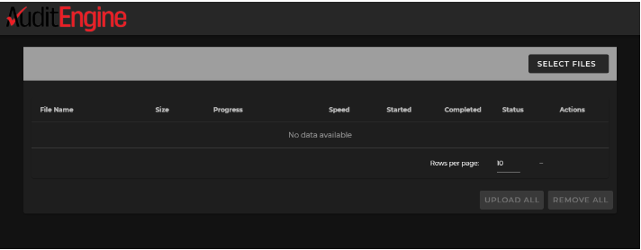
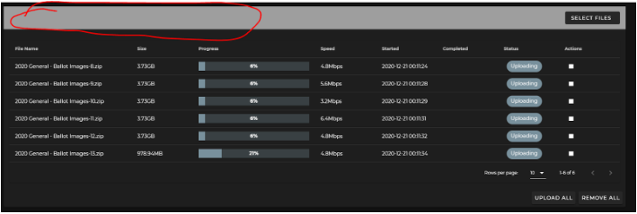

<link rel="icon" type="image/x-icon" href="https://mapper.auditengine.org/assets/images/A.png">


# Sending Election Data to AuditEngine

Sending data to be used by AuditEngine is the same regardless of the vendor, and thus we have just one guide for this. Generally, the options are to 

1. Upload directly to AuditEngine, 
2. Post the files on your site or on a posting service, 
3. Write the data to removable media (AKA Thumbdrives or Flash drives) and deliver that to our office using a delivery service (like UPS, FedEx, or USPS) or, 
4. For extremely large data transfers, we can have a 5TB jump drive delivered to your office and it will be sent directly to cloud storage service provider and avoid lengthy uploading processes.

Below are the steps involved.


## Step 1: Archiving the data

For ease of handling, please archive the ballot image data into ZIP archives. Each zip archive should be less than about 10GB or so for easy handling, or generally up to about 50,000 ballot sheets. But we don't mind if they are larger. Of course, if you use flash drives, they should be smaller than the capacity of those flash drives. If you are uploading, files about 5 to 10 GB are the easiest to handle, particularly if you have slower internet speeds. 

We recommend the free utility 7-zip.org, because the Windows integrated zipper and extractor can be very slow. (Most particularly, avoid right-clicking on any zip folder in Windows or it can take almost forever!) However, if you use this utility, please use the industry standard** .zip** format rather than the proprietary** .7z** format. This is very important for our application to use this data, and is a requirement. Also, do not double-zip the data.

Dominion Cast Vote Records in JSON format should also be combined into one ZIP archive as there may be many hundreds or thousands of files. ES&S Cast Vote Records in .xlsx format can be provided without zipping. There are up to 99,999 ballot images per file, so there may be a few files, and zipping is optional. Ballot Style Masters (PDFs) should be included in one zip archive.


## Step 2: Create Hash Manifests

[Please note: This step is required for counties under contract with AuditEngine for official audits but is optional but recommended for unofficial audits by community groups.]

Hash Manifests provide a way to check that the files match the source files and provide a means to prove that the files are actually the official results. A hash value is a fixed-length "fingerprint" of each file which will change substantially if even one bit is changed, and which is infeasible to predict and it is infeasible to alter a given file to produce another valid file and also produce the same hash.

The same hash values are then generated by the receiver and compared to verify that the files are unchanged. 

A single "hash manifest" file can be prepared that includes a hash value for each file provided in the export of the official results. 

There are several options for creating a hash manifest file for the official results of the election, as described below. These options assume the user is working on a Windows system.


### Option 1: Use QuickHash-GUI

We suggest it might be easier to use the free tool Quickhash-GUI, which can be downloaded from [https://www.quickhash-gui.org/](https://www.quickhash-gui.org/). This is a cross-platform utility that will run on Windows, Linux, or Mac. You can select an entire folder and it will create a CSV file with the following fields: 

- Index
- File Name	
- Path	
- Hash Value	
- File Size (on Disk)	
- Duplicate?

Please use the SHA512 algorithm and create a separate file which should be uploaded with the other data.


### Option 2: Use command line tool

Election officials can create a "(election name)-manifest-sha256.txt" file with content hash values that will comprise all the files in the data set. 

Please use the SHA256 or SHA512 algorithm for creating hash values.

Utilities to create hash values are provided in all Linux and Unix operating systems as standard command-line functions. Equivalent utilities can be obtained for Windows by installing the CygWin set of Linux functions. (Cygwin was originally developed by Cygnus Solutions, and was later sold to RedHat and to IBM) It is a free download from [https://www.cygwin.com/](https://www.cygwin.com/). You can also use similar utilities[^1] if you don't want to download and install the complete cygwin set but make sure you produce linux-compatible output.

In the description here, we will use the md5sum utility provided in the Cygwin distribution. You can use this command to generate a **<code>manifest-sha512.txt</code></strong> file:


```
sha512sum *.*  >manifest-sha512.txt
```


The resulting manifest file for GA_Bartow_20201103, a relatively small county with just over 50K ballots, looks like this in standard unix format. (The hash values here are actually MD5 type). 

    f664b587aacae05c8aa5c591b8659ec4 *CVR_Export_20201103.zip
    9c25af50cb821a897180c9fc1ade9afb *GA_Bartow_20201103 Official Ballots.zip
    7880d59840e3b709321d9312482bb7cf *Nov. 2020 Ballot Images.zip
    0c89d5502de29bd4998b15c354634630 *detailtxt.zip
    ff4d72b4e0f77b086195c77ca6f6ed00 *detailxls.zip
    4344e416b3c186da66f57d115a43532c *detailxml.zip
    9c8fc2b0ebab08c12cc14d3b9a2e95ef *summary.zip

In the example above, the first 32 characters are the hexadecimal expression of the 128 bit MD5 hash value, where each character represents 4 bits. This listing took under two minutes to create, but it can be time consuming if the entire folder has many big files.

In summary, we need only that the election office create the **manifest-sha512.txt** file using the standard unix format as described above for the folder, and that folder should include only regular files or ZIP files, and not subfolders. Any subfolders should be zipped. If you use the MD5 hash algorithm, then the file should be named **manifest-md5.txt**.


## **Step 3: Options for providing data**

AuditEngine processes the elections using cloud resources where we can delegate processing to many thousands of computers in parallel. We use the Amazon Web Services (AWS) "**us-east-1**" datacenter which is in Northern Virginia for elections in the United States. We also archive data in our San Diego, CA facility.


### Option 1: Post Data to a Posting Service

We recommend that you post the ballot image archives and other data to a public posting service so it can be easily downloaded by anyone and thus avoid any incremental work by your staff for each additional request if members of the public wish to access it. Please do not post individual ballot images but always archive them as described above.

The ballot image archives may each be pretty large, and thus they may not be compatible with your official website service provider. The following posting services are just a few of the ones we have encountered, and each has limitations and costs that you should investigate. 

Since AuditEngine is on AWS, we use AWS S3 storage in the same datacenter where our compute service runs. If you use AWS S3, it is very easy for us to transfer the files to the correct region and datacenter for AuditEngine. But the user interface is not as good as with other services. Many of these other services actually use S3 behind the scenes.

We have experience with the following services:


<table>
  <tr>
   <td><strong>Service</strong>
   </td>
   <td><strong>File Limits</strong>
   </td>
   <td><strong>Storage Limits</strong>
   </td>
   <td><strong>Comments</strong>
   </td>
  </tr>
  <tr>
   <td><a href="https://aws.amazon.com/pm/serv-s3/?trk=fecf68c9-3874-4ae2-a7ed-72b6d19c8034&sc_channel=ps&sc_campaign=acquisition&sc_medium=ACQ-P|PS-GO|Brand|Desktop|SU|Storage|S3|US|EN|Text&s_kwcid=AL!4422!3!488982706719!e!!g!!aws%20s3&ef_id=CjwKCAjw46CVBhB1EiwAgy6M4sZJ1svjP15b3ZPhJGM2BkHDCj1fXCb09KqP6klyGwrpsEzPLLpO9xoCsG8QAvD_BwE:G:s&s_kwcid=AL!4422!3!488982706719!e!!g!!aws%20s3">AWS S3</a>
   </td>
   <td>5TB
   </td>
   <td>5GB free, unlimited available. Several access grades based on response time.
   </td>
   <td>Offers WORM equivalent. Impossible to modify timestamps. User interface is not as easy as other options. About $2 per 100GB/Mo.
   </td>
  </tr>
  <tr>
   <td><a href="https://www.box.com/">Box.com</a>
   </td>
   <td>5 GB
   </td>
   <td>100GB to unlimited.
   </td>
   <td>Limits are too low for ballot images, not recommended.
   </td>
  </tr>
  <tr>
   <td><a href="https://www.dropbox.com/">Dropbox</a>
   </td>
   <td>10 GB
   </td>
   <td>Basic: 2GB.  \
up to 5TB for business accounts.
   </td>
   <td>Usable if the zip archives are split into archives less than 10GB. Multiple file downloads are not supported except for zipping them, and so each archive must be individually downloaded.
<p>
Not recommended because storage limits are too low for most jurisdictions.
   </td>
  </tr>
  <tr>
   <td><a href="https://www.google.com/drive/">Google Drive</a>
   </td>
   <td>5TB
   </td>
   <td>Unlimited, depending on plan
   </td>
   <td>
   </td>
  </tr>
  <tr>
   <td><a href="https://www.sharefile.com/">Sharefile</a>
   </td>
   <td>10 GB
   </td>
   <td>Unlimited
   </td>
   <td>Usable if the zip archives are split into archives less than 10GB. Least expensive for unlimited storage.
   </td>
  </tr>
  <tr>
   <td><a href="https://www.sync.com/">Sync.com</a>
   </td>
   <td>No limit
   </td>
   <td>2TB or unlimited.
   </td>
   <td>Used by San Francisco County. Good user interface which allows bulk downloads. Offers a desktop client for Windows.
   </td>
  </tr>
</table>

### Option 2: Uploading the Data to Directly to AuditEngine

AuditEngine has a convenient uploading mechanism to upload all the files to AuditEngine in one convenient step. We now can allocate a single permanent upload link for each county. When files are uploaded using this link, they first go to an upload area so they can be reviewed before being added to the specific election.

If you have not been provided with an upload link, send an email to: [support@citizensoversight.org](mailto:support@citizensoversight.org) and request an upload link and provide the following information:

1. Election jurisdiction (state, county)
2. Election date
3. Election description.

And then an upload link will be sent to you by return email. Then you will upload using the portal at the link sent to you, and this link will remain valid for future use and for other elections in the same district.

Please use a computer with a good broadband connection. Although download speeds on most subscriber ISP services may be extremely fast, the uploading speeds are usually a fraction of the downloading speeds. The AuditEngine uploader is very fast and will upload a number of files in parallel. You can "setup and forget" the uploading job without the need for staff to be present during the uploading. Just check it the next day and make sure everything went well.

The upload dialog looks like the following.




Click SELECT FILES and then select all the files on your computer you want to upload.

Then click UPLOAD ALL. The dialog will track all the files being uploaded, and you will receive an email when each file is successfully uploaded.

You will need to provide your name and email so you can be notified.

After you have selected some files, the uploading job will be tracked in a table format. The name of the district which is being uploaded to will be shown in the circled area. 




Please leave the browser window open for the duration. It can be on a tab you are not using in your browser, or better, use a computer that you are not actively using during the upload. There is no limit to the number of files you can schedule for uploading.Please check that all the files were uploaded properly and if any were not successful, please try again. Normally, we find any issues are with the "last mile" between your office and your Internet Service Provider.

The "Cooperative Workflow" requires that districts upload their files directly to AuditEngine.


### Option 3: Using USB Flash drives

Many districts prefer to use USB Flash drives (also called "USB thumb drives") to send the data to us, because these do not require any Internet connectivity, and USB flash drives are quite inexpensive. These can be sent to us using conventional mail or other shipping services.

You will need to format your flash device to be able to handle files larger than 4GB. The exFAT file system allows a single file larger than 4GB to be stored on the device. This file system is also compatible with Mac.

Windows 7 and Mac OS 10.6.6 and higher are compatible with exFAT out of the box. Older operating systems may need a patch installed for exFAT compatibility.

NOTE: exFAT file system is NOT compatible with some host devices such as TV, game systems, older operating systems, car stereos etc.

Formatting a drive in exFAT


1. Double-click on My Computer.
2. Right-click on the flash drive or memory card, then select Format.
3. In the File System list, click exFAT.
4. Click Start.
5. Click OK to start formatting.

If you use this method, please ship to:

<pre>
    AuditEngine Data Clerk
    Citizens Oversight
    771 Jamacha Rd, #148
    El Cajon, CA 92019
</pre>

Please print out the manifest-sha256.txt file and include it in the package with the drive.

If you want to clip a convenient listing from your screen showing what is included, that is fine. Any reasonable format is accepted. We find this is essential to help get everything included and avoid any need for second requests. 


### Option 4: Using a multi-TB Jump Drive

For extremely large data uploads, we can ship to the election office a 5+ TB USB 3.0 "jump drive" so files can be rapidly copied to that drive, and then a courier will pick it up and transport it directly to the cloud storage service provider by truck and plane, where they will copy it directly from the drive to cloud storage. For very large data transfers, this option can easily beat any internet connection. (There is a small additional charge for this method).

Thank you!

## Notes

[^1]:For example, a similar function can be downloaded from this site: https://www.pc-tools.net/win32/md5sums/   Use the -u switch to create linux-compatible output.
